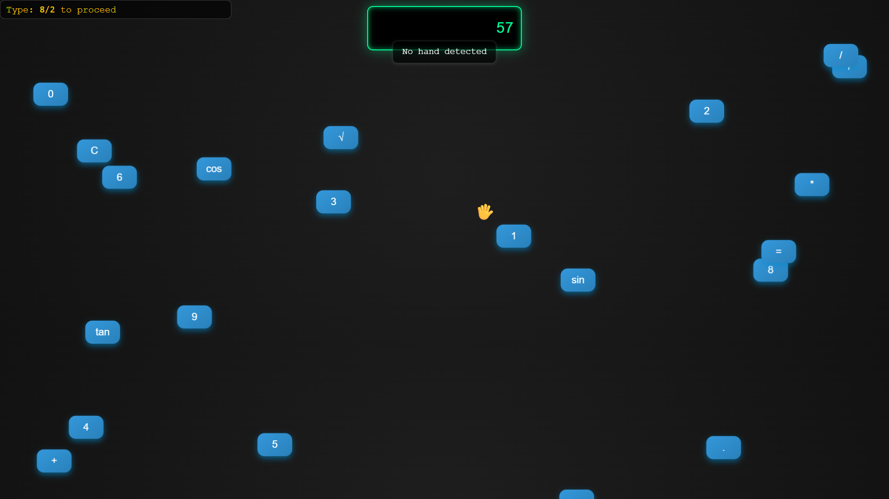

# [Project Name] GrabemNumbers

## Basic Details
### Team Name: Kikiiiiiii

### Team Members
- Team Lead: Aravind K - ASIET
- Member 2: Arjun K - ASIET

### Project Description
GrabemNumbers is a gloriously useless calculator where keys float like balloons, and you “click” them by pinching the air using hand gestures. tpe in an equation? Get roasted by AI. Nail it? Enjoy a Rickroll. Built with vanilla HTML/CSS/JS, Google Mediapipe for hand tracking, and Gemini API for insults.

### The Problem (that doesn't exist)
Many stuggle moving their fingers pressing the really hard buttons on keyboard

### The Solution (that nobody asked for)
I provided them with a cardio workout that helps them type

## Technical Details
### Technologies/Components Used
For Software:
- Programming languages: HTML,CSS,JS
- Libraries used: Google Mediapipe, Gemini API

### Implementation
For Software:
# Installation
 - Replace YOUR_GEMINI_API_KEY with your api key

# Run
Windows (Command Prompt or PowerShell):
bash start calculator.html

macOS (Terminal):
bash open calculator.html

Linux (Terminal):
bash xdg-open calculator.html

### Project Documentation
For Software:

# Screenshots (Add at least 3)

*This screenshot shows the floating calculator with draggable buttons and the hand-controlled cursor using MediaPipe.*

### Project Demo
# Video
[Demo video](https://youtu.be/srihtTul6xg)
*The video exacly displays all functionalities of the application*

## Team Contributions
- Aravind K: Created Idea and suggested improvments
- Arjun K: Improved the idea and implimentation

---
Made with ❤️ at TinkerHub Useless Projects 

